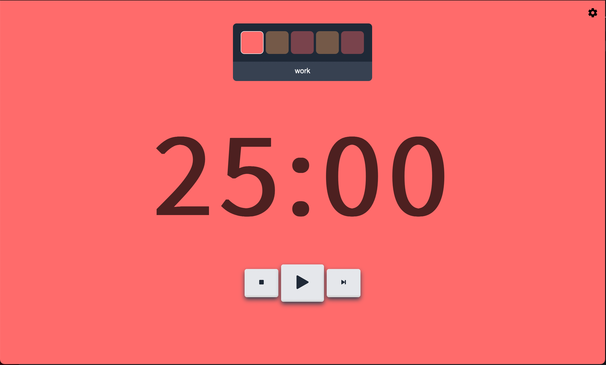

# JAPA
Just Another Pomodoro App is a very creatively named Pomodoro Timer application running in the browser.

## Table of contents
* [General info](#general-info)
* [Technologies](#technologies)
* [Setup](#setup)
* [Screenshots](#screenshots)

## General info
Starting from [this repository](https://github.com/Hanziness/AnotherPomodoro) I decided to replicate the project, just as a mere exercise useful for learning Vue.js.
	
## Technologies
Project is created with:
* Vue.js
* html, javascript, css
	
## Setup
To run this project open ```pomodoro.html``` file in the browser.

## Screenshots

